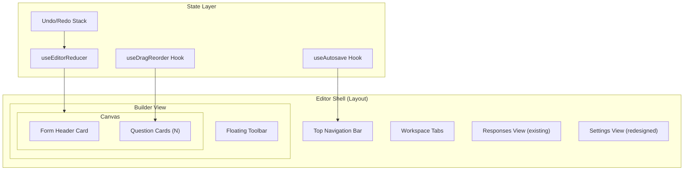
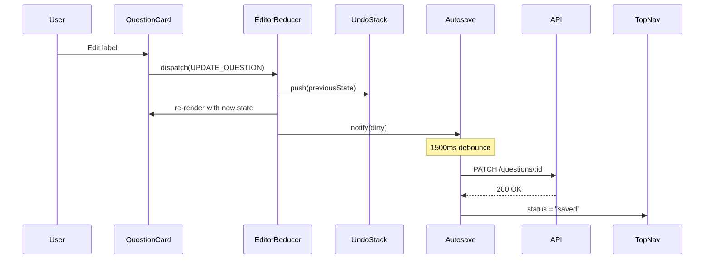

# Design Document: Google Forms UI Redesign

## Overview

This design describes the architectural and component-level approach to redesigning the Qivo Forms editor and respondent view, inspired by Google Forms' design language. The redesign transforms the existing monolithic `FormEditorPage` into a modular, state-driven component architecture with focused editing (active card pattern), autosave, undo/redo, progressive disclosure settings, and a polished respondent experience.

The core philosophy is **progressive disclosure**: show only what's needed, when it's needed. The editor transitions from the current "everything expanded" approach to a focused single-active-card model where inactive questions collapse to minimal summaries.

### Key Design Decisions

1. **Component decomposition over monolithic pages** — The 1100+ line `FormEditorPage` is broken into focused components with clear responsibilities.
2. **Custom state management via `useReducer` + Context** — Rather than introducing a new state library (Redux, Zustand), we use React's built-in patterns with `useReducer` for the editor state machine, keeping the dependency footprint minimal.
3. **CSS Modules for scoped styling** — The project currently uses a single `App.css`. The redesign introduces CSS Modules per component for scoping and maintainability, while preserving global design tokens in a shared file.
4. **Debounced autosave with optimistic UI** — Changes apply immediately to local state; a debounced save syncs to the API. The Save Status Indicator reflects the current sync state.
5. **Existing API surface preserved** — No backend changes required. The redesign consumes the same endpoints (`PATCH /questions/:id`, `POST /questions/reorder`, etc.) with autosave wrapping.

## Architecture

The editor follows a **container/presenter** pattern with a central state reducer managing all form mutations.



### State Flow



## Components and Interfaces

### Component Tree

```
EditorPage
├── TopNav
│   ├── LogoLink
│   ├── InlineEditableTitle
│   ├── SaveStatusIndicator
│   ├── UndoButton
│   ├── RedoButton
│   ├── PreviewButton
│   ├── ShareButton
│   └── PublishButton
├── WorkspaceTabs (Builder | Responses | Settings)
├── BuilderView
│   ├── FormCanvas
│   │   ├── FormHeaderCard
│   │   └── QuestionCard[] (active/inactive state)
│   └── FloatingToolbar
├── ResponsesView (existing ResponseDashboardPage embedded)
└── SettingsView
    ├── CollectionSettings
    ├── AccessSettings
    ├── NotificationSettings
    ├── PresentationSettings
    └── SecuritySettings
```

### Key Component Interfaces

```typescript
// Editor state managed by useReducer
type EditorState = {
  form: FormRecord;
  questions: Question[];
  activeCardId: string | null;
  saveStatus: 'idle' | 'saving' | 'saved' | 'offline' | 'error';
  undoStack: Question[][];
  redoStack: Question[][];
  isDragging: boolean;
  dragSourceIndex: number | null;
  dropTargetIndex: number | null;
};

type EditorAction =
  | { type: 'SET_ACTIVE_CARD'; questionId: string | null }
  | { type: 'UPDATE_QUESTION'; questionId: string; patch: Partial<Question> }
  | { type: 'ADD_QUESTION'; question: Question; afterId?: string }
  | { type: 'DELETE_QUESTION'; questionId: string }
  | { type: 'DUPLICATE_QUESTION'; questionId: string; newQuestion: Question }
  | { type: 'REORDER_QUESTIONS'; fromIndex: number; toIndex: number }
  | { type: 'CHANGE_QUESTION_TYPE'; questionId: string; newType: QuestionType }
  | { type: 'SET_SAVE_STATUS'; status: EditorState['saveStatus'] }
  | { type: 'UNDO' }
  | { type: 'REDO' }
  | { type: 'UPDATE_FORM_TITLE'; title: string }
  | { type: 'DRAG_START'; index: number }
  | { type: 'DRAG_OVER'; index: number }
  | { type: 'DRAG_END' };

// TopNav props
interface TopNavProps {
  formTitle: string;
  saveStatus: EditorState['saveStatus'];
  canUndo: boolean;
  canRedo: boolean;
  formStatus: string;
  onTitleChange: (title: string) => void;
  onUndo: () => void;
  onRedo: () => void;
  onPreview: () => void;
  onShare: () => void;
  onPublish: () => void;
}

// QuestionCard props
interface QuestionCardProps {
  question: Question;
  isActive: boolean;
  index: number;
  onActivate: () => void;
  onUpdate: (patch: Partial<Question>) => void;
  onDelete: () => void;
  onDuplicate: () => void;
  onTypeChange: (newType: QuestionType) => void;
  dragHandleProps: DragHandleProps;
}

// FloatingToolbar props
interface FloatingToolbarProps {
  activeCardId: string | null;
  activeCardIndex: number;
  onAddQuestion: () => void;
  onAddSection: () => void;
  onAddMedia: () => void;
}

// SaveStatusIndicator props
interface SaveStatusIndicatorProps {
  status: EditorState['saveStatus'];
  onRetry?: () => void;
}

// Settings section
interface SettingsSectionProps {
  title: string;
  description: string;
  summary: string;
  defaultExpanded?: boolean;
  children: React.ReactNode;
}
```

### Custom Hooks

```typescript
// Autosave with debounce
function useAutosave(
  formId: string,
  questions: Question[],
  options: { debounceMs: number; onStatusChange: (status: SaveStatus) => void }
): { flush: () => void; retry: () => void };

// Undo/Redo stack management (integrated into reducer)
// The undo stack is capped at 30 entries as per requirements

// Keyboard shortcuts
function useEditorKeyboardShortcuts(
  dispatch: React.Dispatch<EditorAction>,
  state: EditorState
): void;

// Drag and drop reorder
function useDragReorder(
  questions: Question[],
  dispatch: React.Dispatch<EditorAction>
): {
  dragHandleProps: (index: number) => DragHandleProps;
  dropTargetProps: (index: number) => DropTargetProps;
  dragPreview: React.ReactNode | null;
  insertionLineIndex: number | null;
};
```

## Data Models

No database schema changes are required. The redesign operates on the existing data models:

### Existing Models (unchanged)

```typescript
// From types/index.ts - no modifications needed
type Question = {
  id: string;
  label: string;
  description?: string | null;
  type: QuestionType;
  required: boolean;
  options?: QuestionOption[];
  settings?: QuestionSettings;
  conditions?: ConditionRule[];
};

type FormRecord = {
  id: string;
  workspaceId: string;
  title: string;
  description?: string | null;
  slug: string;
  status: string;
  schema: FormSchema;
  createdAt: string;
  updatedAt: string;
};
```

### New Client-Side State Types

```typescript
// Editor-specific types (new file: types/editor.ts)
type SaveStatus = 'idle' | 'saving' | 'saved' | 'offline' | 'error';

type UndoEntry = {
  questions: Question[];
  timestamp: number;
};

type DragState = {
  isDragging: boolean;
  sourceIndex: number | null;
  targetIndex: number | null;
};

// Design tokens (new file: styles/tokens.ts)
const DESIGN_TOKENS = {
  radius: { card: 12, control: 8 },
  shadow: {
    inactive: '0 1px 2px rgba(0,0,0,0.05)',
    active: '0 4px 12px rgba(0,0,0,0.1)',
    floating: '0 8px 24px rgba(0,0,0,0.12)',
  },
  color: {
    primary: '#2563eb',
    canvas: '#f1f5f9',
    cardBg: '#ffffff',
    text: '#111827',
    muted: '#64748b',
  },
  spacing: { cardGap: 16 },
  timing: { transition: '180ms ease', autosaveDebounce: 1500 },
  layout: { canvasMaxWidth: 960, respondentMaxWidth: 680 },
  type: {
    pageTitle: { size: '2rem', weight: 700 },
    sectionTitle: { size: '1.25rem', weight: 600 },
    cardLabel: { size: '1rem', weight: 500 },
    helper: { size: '0.875rem', weight: 400 },
  },
} as const;
```

### API Endpoints Consumed (existing, no changes)

| Endpoint | Method | Usage |
|----------|--------|-------|
| `/api/forms/:formId` | GET | Load form metadata |
| `/api/forms/:formId` | PATCH | Update title/description |
| `/api/forms/:formId/questions` | GET | Load questions |
| `/api/forms/:formId/questions` | POST | Add question |
| `/api/forms/:formId/questions/:qId` | PATCH | Update question (autosave) |
| `/api/forms/:formId/questions/:qId` | DELETE | Delete question |
| `/api/forms/:formId/questions/reorder` | POST | Reorder questions |
| `/api/forms/:formId/settings` | PATCH | Update settings |
| `/api/forms/:formId/publish` | POST | Publish form |


## Correctness Properties

*A property is a characteristic or behavior that should hold true across all valid executions of a system — essentially, a formal statement about what the system should do. Properties serve as the bridge between human-readable specifications and machine-verifiable correctness guarantees.*

### Property 1: Active Card Mutual Exclusion

*For any* form with N questions and any sequence of card activation events, at most one Question_Card shall be in the Active_Card state at any given time, and it shall be the most recently activated card.

**Validates: Requirements 4.1, 4.2**

### Property 2: Card Display State Determines Visible Controls

*For any* Question_Card, when in Inactive_Card state, only the label, type badge, and required indicator shall be rendered; when in Active_Card state, all editing controls (type selector, label input, description input, required toggle, duplicate button, delete button) shall be rendered.

**Validates: Requirements 4.3, 4.4**

### Property 3: Question Insertion Position

*For any* form with N questions and an Active_Card at index i, adding a new question via the Floating_Toolbar shall insert the new question at index i+1, the new question shall become the Active_Card, and the total question count shall be N+1.

**Validates: Requirements 5.3**

### Property 4: Type Change Preserves Compatible Data

*For any* question with any QuestionType, when the type is changed to a different QuestionType, the label, description, and required status shall be preserved unchanged. When changing between SINGLE_CHOICE and MULTIPLE_CHOICE, existing options shall also be preserved.

**Validates: Requirements 6.3**

### Property 5: Autosave Debounce Coalescing

*For any* sequence of N edits occurring within a 1500ms window, only the final state shall be sent to the API as a single save request after 1500ms of inactivity.

**Validates: Requirements 7.1**

### Property 6: Undo Stack Bounded Capacity

*For any* number of edits N performed during an editing session, the undo stack size shall equal min(N, 30). When N exceeds 30, the oldest entry is discarded.

**Validates: Requirements 8.1**

### Property 7: Undo/Redo Round Trip

*For any* valid editor state and any valid edit operation, applying the edit and then undoing shall produce the original state. Applying the edit, undoing, and then redoing shall produce the edited state.

**Validates: Requirements 8.2, 8.3**

### Property 8: Tab Navigation Moves to Adjacent Cards

*For any* form with N questions where the Active_Card is at index i, pressing Tab shall activate the card at index min(i+1, N-1), and pressing Shift+Tab shall activate the card at index max(i-1, 0).

**Validates: Requirements 9.1, 9.2**

### Property 9: Reorder Preserves Relative Order

*For any* list of N questions and any valid move from index `from` to index `to`, the reordered list shall contain the same questions, the moved question shall be at index `to`, and all other questions shall maintain their relative order.

**Validates: Requirements 10.3**

### Property 10: Progress Indicator Calculation

*For any* multi-section form with S sections (S > 1) and the respondent at section index i (0-based), the progress percentage shall equal Math.round((i / S) * 100).

**Validates: Requirements 12.3**

## Error Handling

### Autosave Errors

| Error Type | UI Response | Recovery |
|-----------|-------------|----------|
| Network failure (offline) | Save_Status_Indicator shows "Offline" + warning icon | Queue changes locally; retry on `navigator.onLine` event |
| Server error (5xx) | Save_Status_Indicator shows "Error saving" + retry button | Retry with exponential backoff (max 3 attempts); show manual retry button |
| Conflict (409) | Toast notification "Another user modified this form" | Reload latest state from server, attempt to merge local changes |
| Validation error (4xx) | Inline error on the specific field | Highlight the problematic field; don't retry automatically |

### State Recovery

- **Undo stack overflow**: When exceeding 30 entries, silently discard oldest. No user notification needed.
- **Drag-and-drop failure**: If reorder API call fails, revert local state to pre-drag positions and show error toast.
- **Preview with unsaved changes**: Serialize current local state to sessionStorage before opening preview tab.

### Form Loading Errors

- **Network timeout**: Show skeleton loading state for 3s, then show retry button.
- **404 (form not found)**: Show "Form not available" card with link back to dashboard.
- **403 (unauthorized)**: Redirect to login with return URL.

### Respondent View Errors

- **Section navigation failure**: If a section fails to render, show inline error and allow back navigation.
- **Submission failure**: Keep all answers in local state; show error message with retry button. Do not clear the form.
- **Offline during submission**: Queue submission attempt; show "Your response will be submitted when you're back online."

## Testing Strategy

### Unit Tests (Example-based)

Focus on specific scenarios and edge cases:

- **TopNav**: Renders all elements; title edit mode toggle; overflow menu at <768px
- **WorkspaceTabs**: Tab switching; default tab; active indicator
- **QuestionCard**: Renders correct controls per state; hover reveals drag handle
- **FloatingToolbar**: Correct positioning; button presence; responsive layout
- **SettingsView**: Five groups render; expand/collapse; summary display
- **RespondentView**: Branding display; section navigation; submission flow
- **PreviewMode**: Opens in new tab; banner present; uses same component

### Property-Based Tests

Property-based testing is appropriate for the logic-heavy state management in this feature (undo/redo, card state machine, reorder, autosave debounce, navigation).

**Library**: [fast-check](https://github.com/dubzzz/fast-check) (already compatible with the project's Vite + TypeScript setup)

**Configuration**: Minimum 100 iterations per property test.

**Test Tags**: Each test will be tagged with `Feature: google-forms-ui-redesign, Property {N}: {description}`

Properties to implement:
1. Active card mutual exclusion — generate random activation sequences
2. Card display state determines controls — generate questions of random types in random states
3. Question insertion position — generate forms of random sizes with random active indices
4. Type change data preservation — generate questions with random data, change to random types
5. Autosave debounce coalescing — generate rapid edit sequences with random timing
6. Undo stack bounded capacity — generate random numbers of edits
7. Undo/Redo round trip — generate random states and random edit operations
8. Tab navigation — generate forms of random sizes with random active positions
9. Reorder preserves relative order — generate random lists and random (from, to) pairs
10. Progress indicator calculation — generate random section counts and current indices

### Integration Tests

- **Full editor flow**: Load form → edit question → verify autosave → undo → verify state
- **Drag-and-drop**: End-to-end reorder with API mock
- **Keyboard navigation**: Full Tab/Shift+Tab cycle through all questions
- **Responsive breakpoints**: Verify layout changes at 768px threshold
- **Accessibility**: axe-core audit on editor and respondent views

### Visual Regression Tests

- **Design token compliance**: Verify border-radius, shadows, colors, typography match spec
- **Active/inactive card transitions**: Screenshot comparison
- **Respondent view branding**: Screenshot with various branding configurations
